<div align="center">


# PrintOS

**Sistema de gestão para gráficas — do arquivo à entrega, tudo em um só lugar.**

Pedidos, orçamentos, produção, caixa e catálogo em uma interface única.
Cada gráfica com seus próprios dados, isolados no banco.

<br />


[](https://github.com/Diangeles1/PrintOS/actions/workflows/ci.yml)

<br />

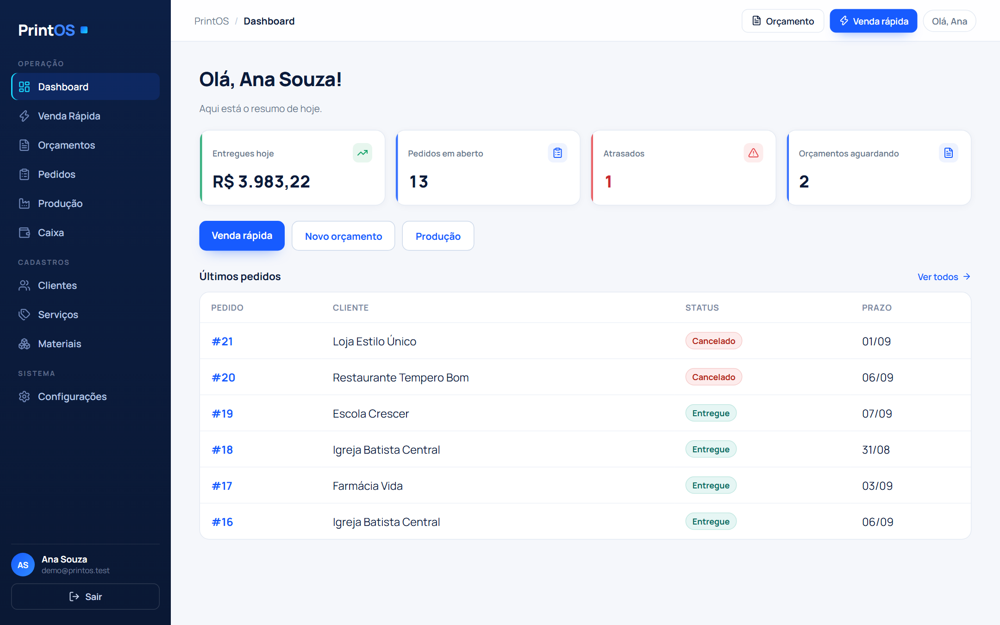

</div>

---

## Índice

- [Sobre o PrintOS](#sobre-o-printos)
- [Funcionalidades](#funcionalidades)
- [Interface](#interface)
- [Tecnologias](#tecnologias)
- [Arquitetura](#arquitetura)
- [Estrutura do projeto](#estrutura-do-projeto)
- [Instalação](#instalação)
- [Configuração](#configuração)
- [Testes](#testes)
- [Segurança](#segurança)
- [Roadmap](#roadmap)
- [Contribuindo](#contribuindo)
- [Licença](#licença)

---

## Sobre o PrintOS

Gráfica rápida vive de muitos pedidos pequenos, prazos curtos e informação espalhada
por caderno, WhatsApp e planilha. O **PrintOS** junta tudo isso em um sistema só:
o pedido entra, vira produção, o cliente aprova a arte por um link, e o balcão fecha
a venda — com o histórico sempre à mão.

- **Para quem:** gráficas rápidas, copiadoras e estúdios de comunicação visual — do balcão à entrega.
- **O que resolve:** centraliza pedidos, orçamentos, clientes, catálogo de preços, produção e caixa; reduz retrabalho e "pedido perdido".
- **Multi-empresa:** cada gráfica (conta) enxerga somente os próprios dados. O isolamento é garantido no banco por *Row Level Security*, testado tabela a tabela.
- **Papéis:** **dono** (acesso total) e **funcionário** (só a Venda Rápida e o próprio total do dia).

> O PrintOS organiza a operação da gráfica. **Não processa pagamentos, não movimenta
> dinheiro da empresa e não funciona como carteira ou gateway** — os valores de caixa
> são apenas registro de conferência do balcão.

---

## Funcionalidades

### Dashboard

Resumo do dia assim que entra: entregues hoje (R$), pedidos em aberto, atrasados
(em vermelho quando há) e orçamentos aguardando resposta — com os últimos pedidos logo abaixo.

<p align="center">
  
</p>

### Pedidos e Produção

Lista de pedidos com filtro por status, total, contagem de itens e a origem de cada um
(**manual**, **venda rápida** ou **WhatsApp**). O editor de pedido tem itens do catálogo
ou livres, prazo, forma de pagamento, miniaturas da arte e o link de aprovação do cliente.
A **Produção** é um quadro kanban: _aguardando arte → em produção → pronto → entregue_.

<p align="center">
  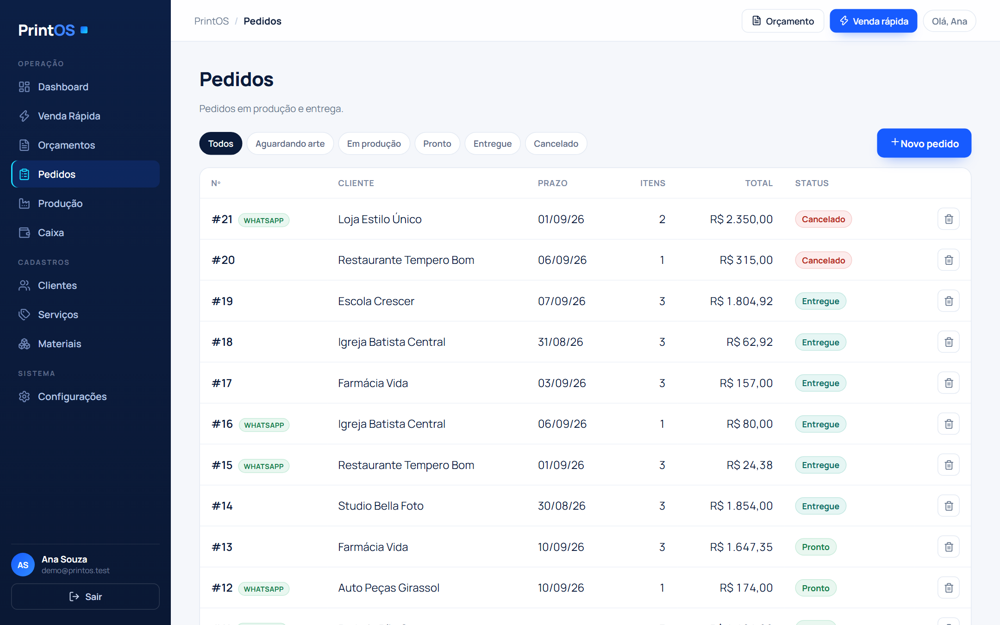
  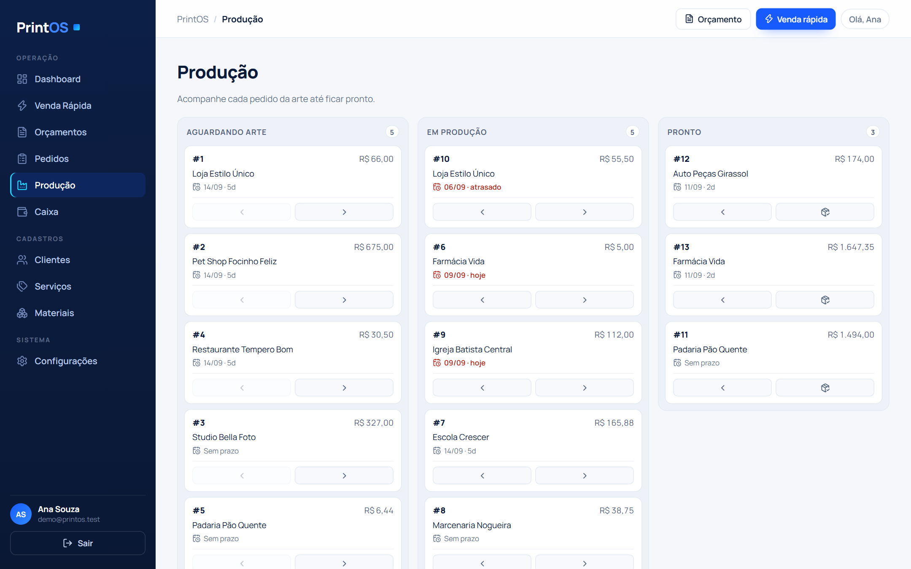
</p>

### Orçamentos

Editor com numeração automática, itens do catálogo e itens livres, desconto, controle de
status (_rascunho → enviado → aprovado / recusado_) e um **documento pronto para impressão / PDF**
com a identidade da gráfica. Orçamento aprovado vira pedido com um clique.

<p align="center">
  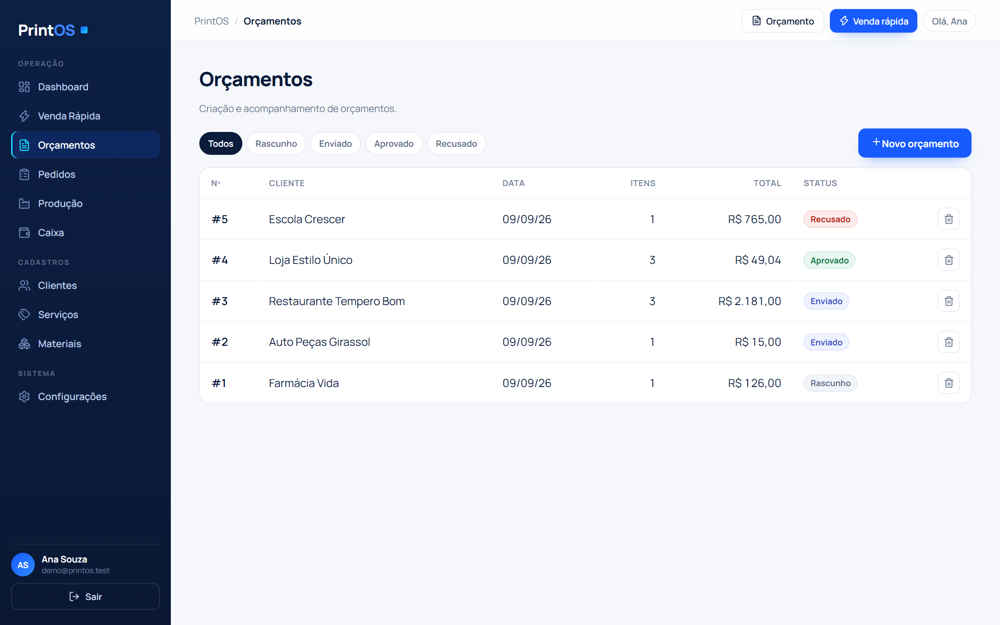
  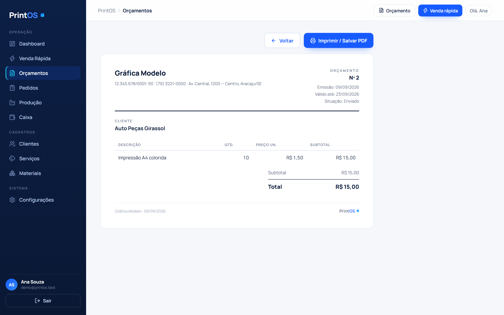
</p>

### Venda Rápida e Caixa

**Venda Rápida** é o PDV de balcão: toca nos itens do catálogo, ajusta a quantidade e
finaliza — cria o pedido já entregue e, se houver caixa aberto, lança a entrada.
O **Caixa** controla uma sessão por vez, com entradas, saídas e fechamento com conferência
de valor esperado.

<p align="center">
  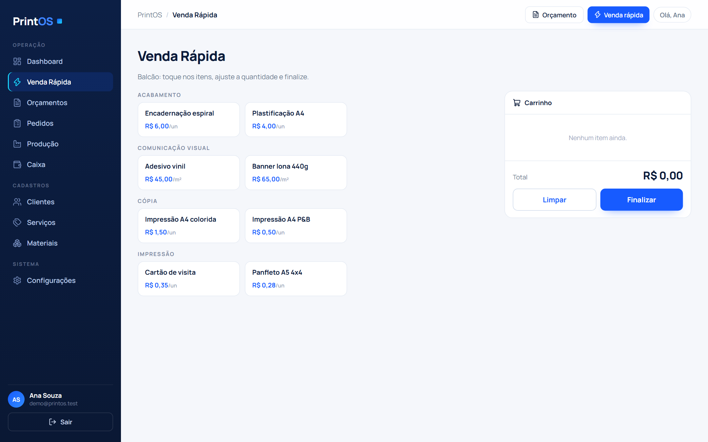
  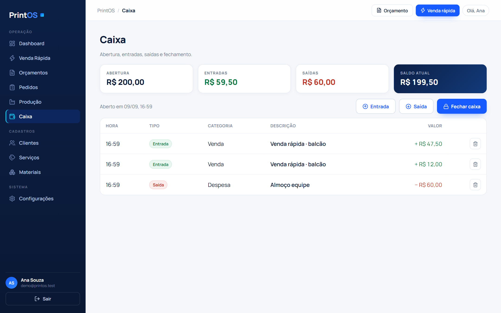
</p>

### WhatsApp: registro de pedidos e aprovação de arte

Duas frentes complementares:

- **Extensão do WhatsApp Web** (`extensao/`, MV3): um botão flutuante "＋ Pedido" na tela do
  WhatsApp Web abre um formulário rápido e cria o pedido no PrintOS por um endpoint autenticado
  por token — a extensão só cria pedido e anexa arte, não lê contatos nem apaga nada.
- **Aprovação de arte por link público** (`/aprovar/[token]`): a gráfica gera um link, manda
  no WhatsApp junto com a arte; o cliente abre, confere e responde **Aprovar / Solicitar
  alteração / Recusar**. Aprovado, o pedido anda sozinho para produção.

<p align="center">
  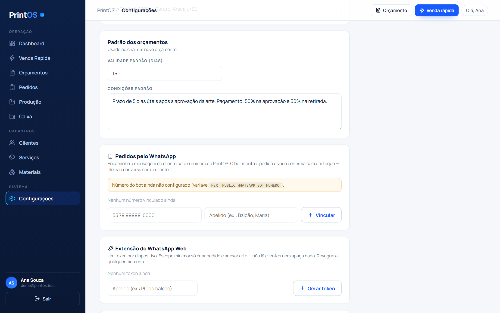
  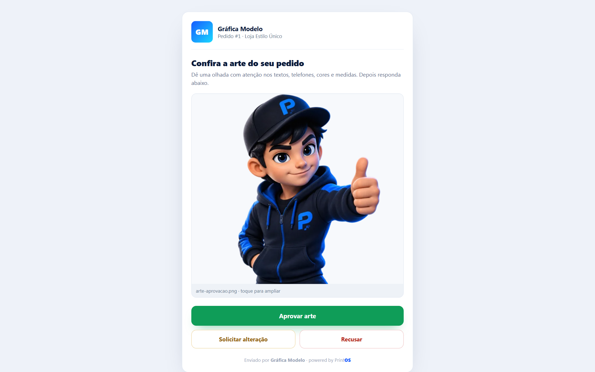
</p>

### Cadastros: Clientes, Serviços e Materiais

CRUDs enxutos com busca. **Serviços** é o catálogo de preços usado nos orçamentos e na
venda rápida; **Materiais** controla insumos e estoque, com alerta de estoque baixo.
Ambos têm um **catálogo sugerido** de base gráfica, inserido com um clique.

<p align="center">
  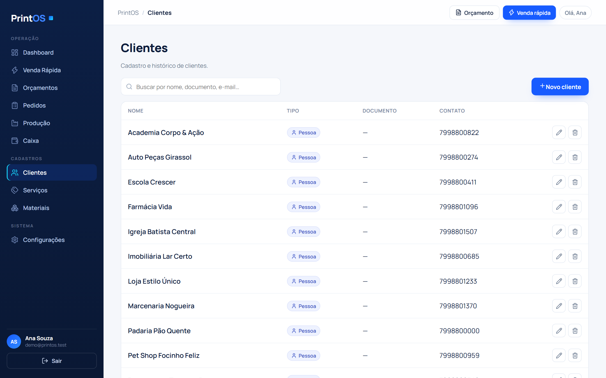
  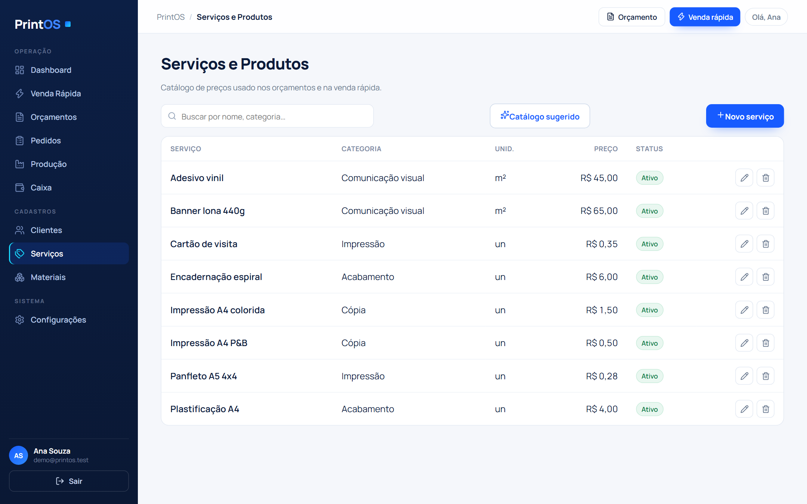
</p>

### Configurações

Identidade da empresa (nome, documento, contato e logo — que aparece no documento do
orçamento), padrões de orçamento (validade e condições), integração com o WhatsApp,
tokens da extensão e a lista de funcionários.

<p align="center">
  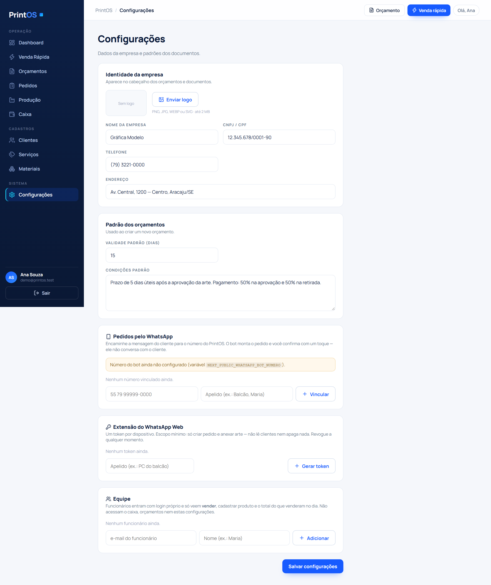
</p>

### Console administrativo

Um painel interno (`/admin`) restrito por **lista de e-mails** (`SUPERADMIN_EMAILS`),
para suporte à operação: lista de contas, detalhe de conta e ações (confirmar e-mail,
gerar magic link, editar dados, suspender) — com **auditoria append-only** de tudo.

---

## Interface

<p align="center">
  
</p>

<p align="center">
  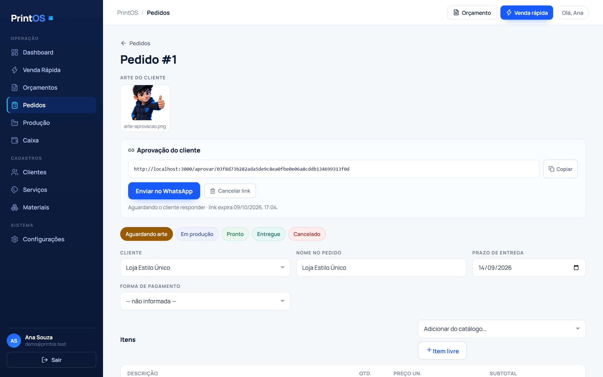
  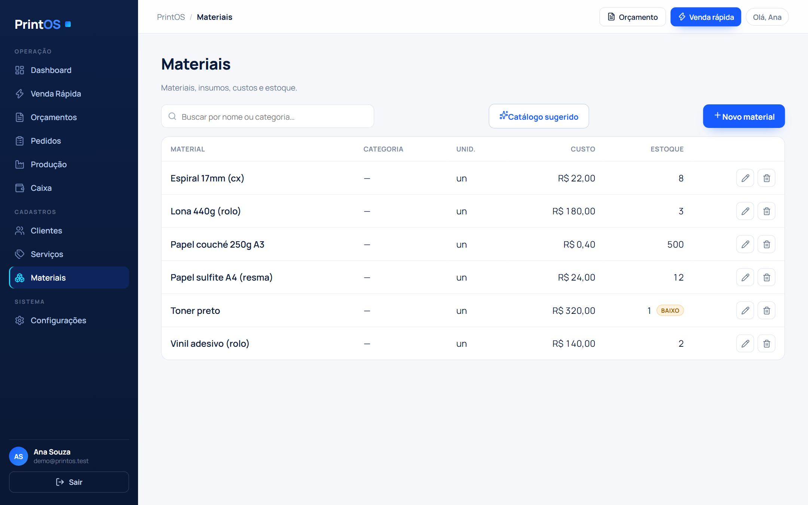
</p>

<p align="center">
  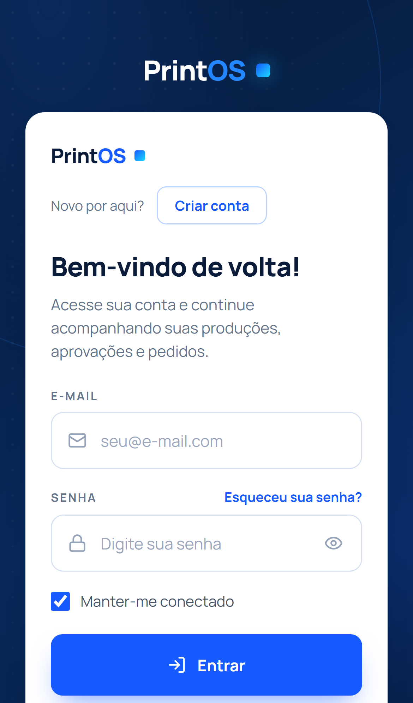
  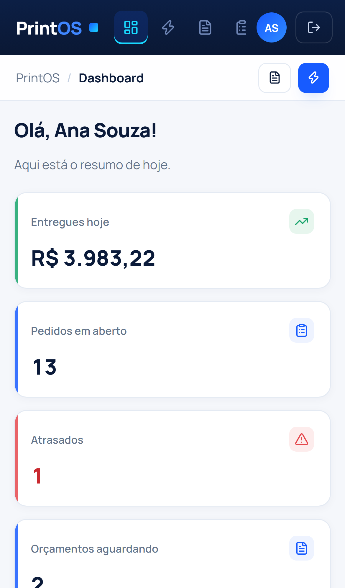
</p>

---

## Tecnologias

| Camada | Stack |
|---|---|
| **Framework** | [Next.js 16](https://nextjs.org) — App Router, Route Groups, Middleware, Server Components |
| **UI** | [React 19](https://react.dev), TypeScript (strict), CSS global sob medida (sem Tailwind), ícones [lucide-react](https://lucide.dev), fonte [Manrope](https://fonts.google.com/specimen/Manrope) via `next/font` |
| **Backend / Dados** | [Supabase](https://supabase.com) — PostgreSQL, Auth por cookie (`@supabase/ssr`), Row Level Security, Storage, funções e triggers no banco |
| **Autenticação** | E-mail + senha, Google e Microsoft (OAuth PKCE) |
| **Integrações** | WhatsApp Cloud API (webhook) · Extensão Chrome MV3 para o WhatsApp Web |
| **Qualidade** | [Playwright](https://playwright.dev) (E2E) · suíte de testes em Node puro · GitHub Actions (CI) |
| **Deploy** | [Vercel](https://vercel.com) + projeto Supabase gerenciado |

<p>
  
  
  
  
  
  
</p>

---

## Arquitetura

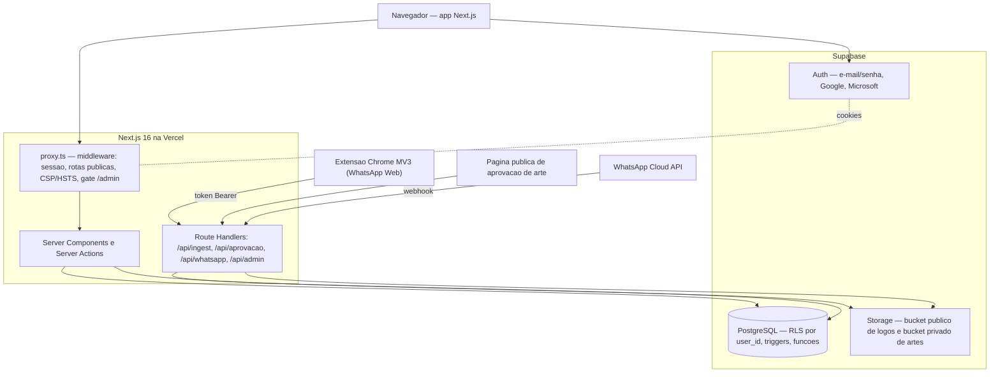
```mermaid
flowchart TD
    B["Navegador — app Next.js"]
    EXT["Extensao Chrome MV3 (WhatsApp Web)"]
    PUB["Pagina publica de aprovacao de arte"]

    subgraph NEXT["Next.js 16 na Vercel"]
        MW["proxy.ts — middleware: sessao, rotas publicas, CSP/HSTS, gate /admin"]
        RSC["Server Components e Server Actions"]
        API["Route Handlers: /api/ingest, /api/aprovacao, /api/whatsapp, /api/admin"]
    end

    subgraph SUPA["Supabase"]
        AUTH["Auth — e-mail/senha, Google, Microsoft"]
        DB[("PostgreSQL — RLS por user_id, triggers, funcoes")]
        ST["Storage — bucket publico de logos e bucket privado de artes"]
    end

    WA["WhatsApp Cloud API"]

    B --> MW --> RSC --> DB
    B --> AUTH
    EXT -->|token Bearer| API
    PUB --> API
    WA -->|webhook| API
    API --> DB
    API --> ST
    RSC --> ST
    AUTH -. cookies .- MW
```

- **Frontend:** Next.js App Router. Páginas internas ficam no grupo de rotas `app/(app)/`, atrás de um layout com barra lateral e topo. Estilo é um CSS global com classes por prefixo (`.ax-*`, `.pl-*`, `.cl-*`, …).
- **Camada de acesso:** `lib/supabase/` expõe três clientes — browser, server (com cookies) e admin (`service_role`, só no servidor). O middleware `proxy.ts` valida a sessão, libera as rotas públicas, injeta cabeçalhos de segurança e bloqueia `/admin`.
- **Banco:** 16 migrações versionadas em `supabase/migrations/`. Toda tabela é `user_id`-escopada com RLS `auth.uid() = user_id`; totais são colunas geradas / triggers; operações entre tabelas usam funções `security definer`; `anon` não tem grant.
- **Integrações:** endpoints dedicados para a extensão (`/api/ingest/pedido`, token com hash SHA-256 no banco, rate limit e allowlist de MIME), para a aprovação pública (`/api/aprovacao/[token]`) e para o webhook do WhatsApp.

---

## Estrutura do projeto

```
printos/
├── app/
│   ├── (app)/              # área logada (dashboard, pedidos, produção, caixa, cadastros, configurações)
│   │   ├── _components/     # Sidebar, Topbar, Skeletons
│   │   ├── pedidos/  orcamentos/  producao/  caixa/  venda-rapida/
│   │   └── clientes/  servicos/  materiais/  configuracoes/
│   ├── admin/              # console do SuperADMIN + auditoria
│   ├── aprovar/[token]/    # página pública de aprovação de arte
│   ├── api/                # ingest · aprovacao · whatsapp · admin · equipe
│   ├── auth/callback/      # troca do code OAuth (PKCE)
│   ├── login/  boas-vindas/  redefinir-senha/
│   └── layout.tsx  page.tsx  globals.css
├── lib/
│   ├── supabase/          # clientes browser / server / admin
│   ├── admin/  equipe.ts  catalogo.ts  whatsapp.ts
├── supabase/migrations/   # 0001…0016 — schema, RLS, triggers, funções
├── extensao/              # extensão Chrome MV3 para o WhatsApp Web
├── e2e/                   # testes Playwright
├── scripts/               # testes em Node, seed, simulador, automações
├── docs/                  # deploy, whatsapp, auto-publish, screenshots
└── proxy.ts               # middleware (sessão, segurança, rotas públicas)
```

---

## Instalação

**Pré-requisitos:** Node 20+ e um projeto [Supabase](https://supabase.com) (o plano free serve).

```bash
git clone https://github.com/Diangeles1/PrintOS.git
cd PrintOS
npm install
```

Crie o arquivo `.env.local` (veja [Configuração](#configuração)) e aplique as migrações
de `supabase/migrations/` no seu projeto Supabase — pelo **SQL Editor** do painel ou pela
CLI, em ordem (`0001` → `0016`).

```bash
npm run dev
```

A aplicação sobe em **http://localhost:3000**.

Para navegar o sistema já com dados, crie uma conta pela tela de cadastro e rode:

```bash
npm run seed:demo -- voce@email.com
```

---

## Configuração

Variáveis de ambiente (`.env.local`) — os nomes vêm de [`.env.example`](.env.example).
**Nunca** versione o `.env.local` nem cole valores reais em lugar nenhum.

| Variável | Obrigatória | Para quê |
|---|:---:|---|
| `NEXT_PUBLIC_SUPABASE_URL` | ✅ | URL do projeto Supabase |
| `NEXT_PUBLIC_SUPABASE_PUBLISHABLE_KEY` | ✅ | Chave pública (anon) do Supabase |
| `NEXT_PUBLIC_APP_URL` | ✅ | URL pública do app, usada nos links enviados ao cliente |
| `SUPABASE_SERVICE_ROLE_KEY` | — | Chave `service_role` — **só no servidor**. Habilita webhook, ingest e admin |
| `WHATSAPP_TOKEN` · `WHATSAPP_PHONE_ID` | — | Credenciais da WhatsApp Cloud API (Meta) |
| `WHATSAPP_VERIFY_TOKEN` · `WHATSAPP_APP_SECRET` | — | Verificação e assinatura do webhook do WhatsApp |
| `NEXT_PUBLIC_WHATSAPP_BOT_NUMERO` | — | Número do bot exibido em Configurações |
| `SUPERADMIN_EMAILS` | — | E-mails (separados por vírgula) com acesso a `/admin`. Vazio desativa o painel |

```dotenv
# .env.local — exemplo (preencha com os seus valores)
NEXT_PUBLIC_SUPABASE_URL=https://SEU-PROJETO.supabase.co
NEXT_PUBLIC_SUPABASE_PUBLISHABLE_KEY=sua_chave_publica
NEXT_PUBLIC_APP_URL=http://localhost:3000
SUPABASE_SERVICE_ROLE_KEY=sua_service_role_key
SUPERADMIN_EMAILS=
```

O runbook completo de produção (Supabase, Auth, Storage, Vercel, checklist de segurança)
está em [`docs/deploy.md`](docs/deploy.md); a configuração da Meta em [`docs/whatsapp.md`](docs/whatsapp.md).

---

## Testes

Suíte em Node puro (sem dependência nova) + Playwright. Precisam de `.env.local` com a
`service_role` e criam/apagam usuários `@printos.test` no seu projeto — rode contra um
projeto de **staging** quando possível.

```bash
npm run test:tudo      # isolamento multi-tenant (RLS tabela a tabela) + regras de negócio + equipe
npm run e2e            # Playwright: fluxo completo + console admin e segurança (servidor no ar)
npm run seed:demo -- voce@email.com     # popula uma conta com dados realistas
npm run simular                         # simulador de operação ao vivo
```

O CI (GitHub Actions) roda *typecheck* + *build* em todo push; os testes de banco e E2E
rodam quando os segredos do Supabase estão configurados no repositório.

---

## Segurança

- **Isolamento por conta:** RLS em todas as tabelas (`auth.uid() = user_id`); `anon` sem grant. Coberto por `npm run test:isolamento`.
- **Segredos:** `.env.local`, tokens e chaves ficam fora do versionamento (`.gitignore`). A `service_role` só é usada no servidor. Este repositório não contém credenciais.
- **Cabeçalhos:** `proxy.ts` aplica `Content-Security-Policy`, `Strict-Transport-Security` (em HTTPS), `X-Frame-Options: DENY`, `X-Content-Type-Options`, `Referrer-Policy` e `Permissions-Policy` em toda resposta.
- **Endpoints públicos:** o ingest da extensão autentica por token (apenas o hash SHA-256 vai ao banco), com rate limit, expiração e allowlist de MIME; a aprovação pública responde só via `service_role` e um trigger impede que um link aponte para pedido de outra conta (anti-IDOR).
- **Admin:** `/admin` é restrito por lista de e-mails, exige header anti-CSRF + checagem de *same-origin*, e toda ação é gravada em auditoria append-only.
- Encontrou algo? Abra uma issue **sem** incluir dados sensíveis, ou fale direto com o mantenedor.

---

## Roadmap

Baseado em `docs/deploy.md` e nas pendências do código — sujeito a mudança.

- [x] Núcleo: pedidos, orçamentos, produção, caixa, venda rápida, cadastros
- [x] Aprovação de arte por link público
- [x] Extensão do WhatsApp Web + endpoint de ingest seguro
- [x] Console administrativo com auditoria
- [x] Papéis dono / funcionário
- [x] CI + testes de isolamento e E2E
- [ ] Ativar a WhatsApp Cloud API em produção (número + token da Meta)
- [ ] Limpeza automática de arquivos órfãos no bucket `pedido-arquivos` ao excluir um pedido
- [ ] "Manter-me conectado" com efeito real na sessão
- [ ] Relatórios de período (faturamento, mix de serviços)

---

## Contribuindo

1. Faça um fork e crie um branch: `git checkout -b minha-mudanca`
2. Instale as dependências e configure o `.env.local`
3. Rode `npx tsc --noEmit`, `npm run build` e `npm run test:tudo` antes de abrir o PR
4. Descreva o que mudou e por quê; inclua screenshots quando for mexer em UI
5. Abra o Pull Request para o branch `main`

Padrões: TypeScript strict, componentes no estilo dos existentes, CSS no `globals.css`
seguindo o prefixo da área. Mudança de schema entra como uma nova migração numerada em
`supabase/migrations/`.

---

## Licença

Projeto **proprietário** — `package.json` marca `"private": true` e não há licença
open-source definida. Todos os direitos reservados ao mantenedor. Para uso, cópia ou
distribuição, fale com o autor.

---

<p align="center">
  Feito para tornar a gestão de gráficas mais simples, organizada e profissional.
</p>
